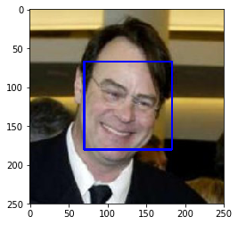
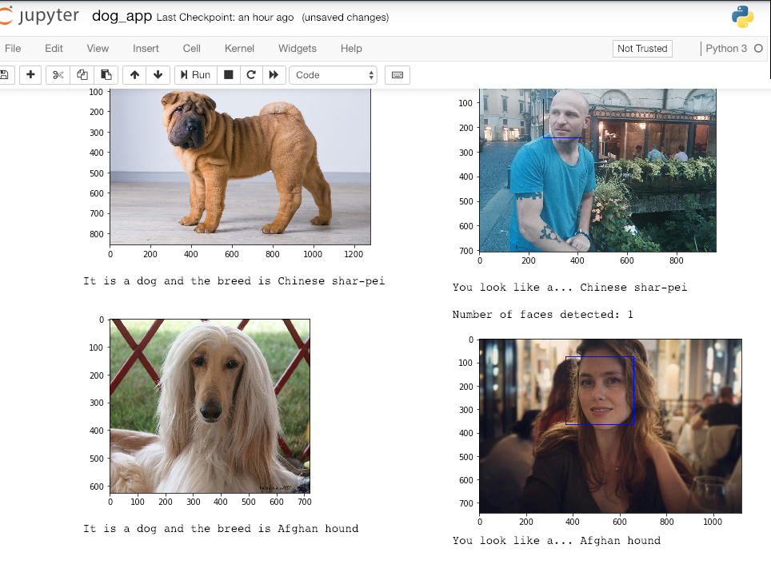

# Dogs-image-classifier
A convolutional neural network model to identify dog breeds. (Udacity nanodegree "Deep Learning")

## Project Description
The CNN model is built in a [Jupyter notebook](dog_app - Eddie Goldenberg.ipynb) using Pytorch.
It is made of a few different functions and two models: CNN from scratch and CNN based on transfer learning.
The training and test data is not icluded in this Github.
The project was created for Udacity Nanodegree "Deep Learning" and is partialy their code

### Face Recognition
An algorithm recognizing faces in images using face_cascade

### Prediciton with a pre-trained model
Using VGG16 and Resnet50 to predict dog breeds

### A CNN from scratch
Augmenting data to 224X224 images and training and validating the data on a CNN model made of 5 convolutional layers and 2 fully connected layers reaching a best valid accuracy of 0.1233 after and valid loss of 3.77 after 9 epochs

### A CNN using transfer learning
Data augmented like before, this time using a pre-trained VGG16 model with a change to its output to 133 to fit 133 classes of dogs. Best valid accuracy of 0.8275 with valid loss of 0.56 after 5 epochs.

### Human or Dog
An algorithm which identify if the image is of a dog or a human. If it is a dog - the algorithm tells its breed. If it's human - the algorithm says which dog the human looks like.

